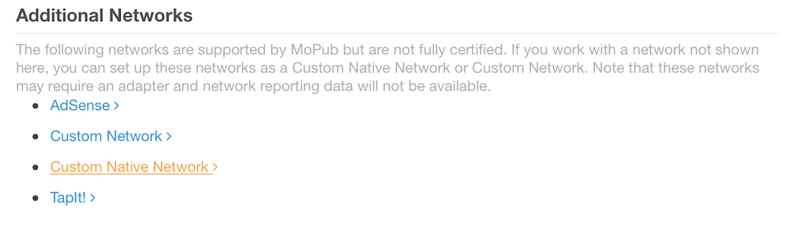
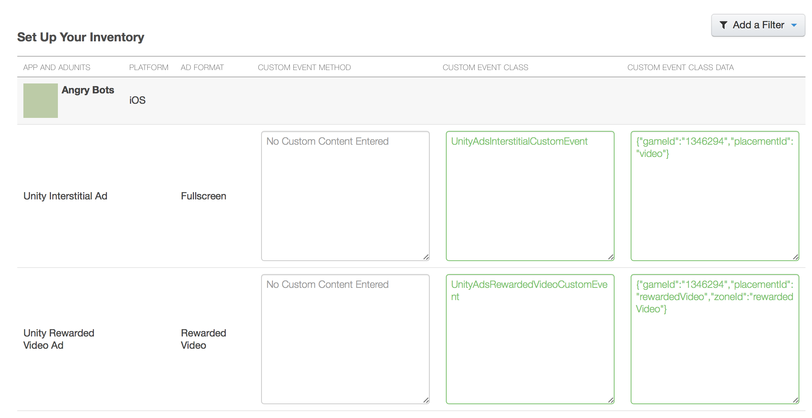
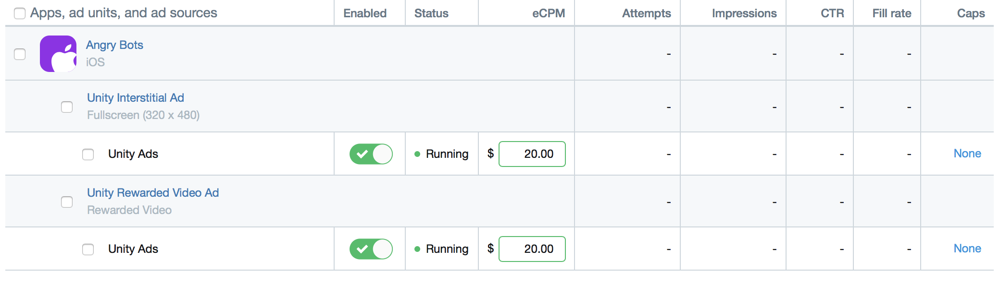

# Unity Ads with MoPub Mediation SDK (iOS)

Welcome to the integration guide for Unity Ads iOS using the MoPub Mediation SDK

Sign up for Unity Ads at [https://unity3d.com/services](https://unity3d.com/services)
Sign up for MoPub account at [http://app.mopub.com/](http://app.mopub.com/)

## Need Help?

1. Visit the [Unity Ads Forum](https://forum.unity3d.com/forums/unity-ads.67/)
2. Email [unityads-support@unity3d.com](mailto:unityads-support@unity3d.com)


## Download

Download [Unity Ads iOS SDK](https://github.com/Unity-Technologies/unity-ads-ios)
The current version of the SDK is 2.1.0

Binaries can be found from the [releases tab](https://github.com/Unity-Technologies/unity-ads-ios/releases).

Download [MoPub iOS SDK](https://github.com/mopub/mopub-ios-sdk)

Download [MoPub - Unity Adapter](https://github.com/monicataina/mopub-ios-sdk)
* Customize Unity Ads adapter which perform better

Using CocoaPod
```
pod 'UnityAds'
pod 'mopub-ios-sdk'
```

## MoPub Dashboard Setup

To ensure that the MoPub servers recognize the integrated Unity Ads Adapters, we’ll need to set up Unity Ads as a Custom Native Network in the MoPub dashboard. We can do this with a few straight forward steps:

1. Set Up Unity Ads as a Custom Native Network
- While logged into the MoPub dashboard, navigate to ** Networks > Add a Network > Custom Native Network** at the bottom of the page


2. Enter “Custom Event Class” & “Custom Event Class Data”


3. Configure Unity Ads for control waterfall position in Segment Detail page


## Set Up in Xcode

1. Add all the Unity Ads related Adapter Files (under /AdNetworkSupport/Unity/ in MoPUb SDK) your app’s project and make sure they are included in the project's Build Phases > Compile Sources.

2. Download the Unity Ads iOS SDK and copy the UnityAds.framework folder into /AdNetworkSupport/Unity/SDK/
- Make sure the project's Build Settings > Framework Search Path includes the UnityAds.framework (for example: $(PROJECT_DIR)/AdNetworkSupport/Unity/SDK/UnityAds.framework)

- Make sure UnityAds.framework is included in the project's Build Phases > Link Binary With Libraries.

Please refer to the complete setup of the [Unity Ads iOS SDK](https://github.com/Unity-Technologies/unity-ads-ios) 

3. Call MPInterstitialAdController’s showFromViewController method (or, for rewarded ads, MPRewardedVideo's presentRewardedVideoAdForAdUnitID method) when you want to present a Unity video ad! (No need to call the Unity iOS SDK methods directly. MoPub SDK will do it.)

## Example Code

```csharp
@implementation ViewController

static NSString *const kUnityAdsRewardedVideoAdUnitID = @"f89821455f784e2bb22f236c21c56d9e";
static NSString *const kUnityAdsInterstitialAdUnitID = @"0a013c1e58584a4ea2fae0cc863fb248";

- (void)viewDidLoad {
    [super viewDidLoad];
    
    // Init Unity Rewarded Video
    [[MoPub sharedInstance] initializeRewardedVideoWithGlobalMediationSettings:nil delegate:self];
    [MPRewardedVideo loadRewardedVideoAdWithAdUnitID:kUnityAdsRewardedVideoAdUnitID withMediationSettings:nil];
    
    // Init Unity Interstitial
    self.interstitial = [MPInterstitialAdController
                         interstitialAdControllerForAdUnitId:kUnityAdsInterstitialAdUnitID];
    self.interstitial.delegate = self;
    [self.interstitial loadAd];
}

- (IBAction)didTapShowRewardedVideoButton:(id)sender
{
    [MPRewardedVideo presentRewardedVideoAdForAdUnitID:kUnityAdsRewardedVideoAdUnitID fromViewController:self withReward:nil];
}

- (IBAction)didTapShowInterstitialButton:(id)sender
{
    if (self.interstitial.ready) {
        [self.interstitial showFromViewController:self];
    } else {
        // The interstitial wasn't ready, so continue as usual.
    }
}

#pragma mark - <MPRewardedVideoDelegate>

- (void)rewardedVideoAdDidDisappearForAdUnitID:(NSString *)adUnitID {
    [MPRewardedVideo loadRewardedVideoAdWithAdUnitID:kUnityAdsRewardedVideoAdUnitID withMediationSettings:nil];
}


```

 

